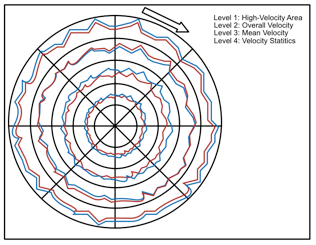
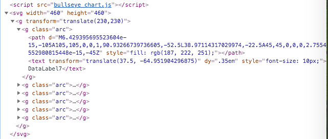
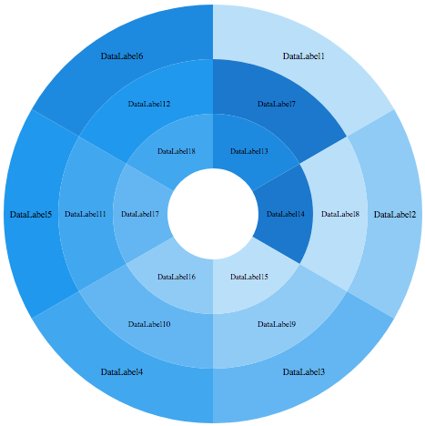

# D3BullseyeChart

Requirements:
1. Bullseye Chart (BC) constis of a dynamic number of donut subplots.
2. BC is zoomable.
3. Each donut subplot fragment has a parallel coordinat subplot (example image shows still line charts).

Optional: Zooming from out to in has the effect that the last outer ring (level) disappears. 

My problems:
I want a way to create dynamic donut subplots.
In my solution I iterate over a loop to create donut charts (see work in process branch). 
I add these charts in a container to create hopefully a zoomable object.

At the moment I get one chart instead of two. 
I have no idea why I see just one chart instead of two.

