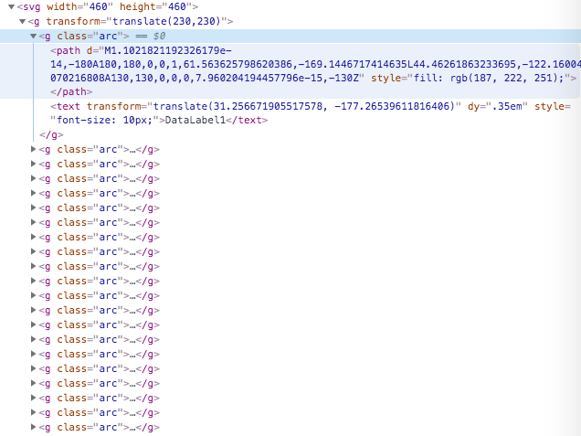
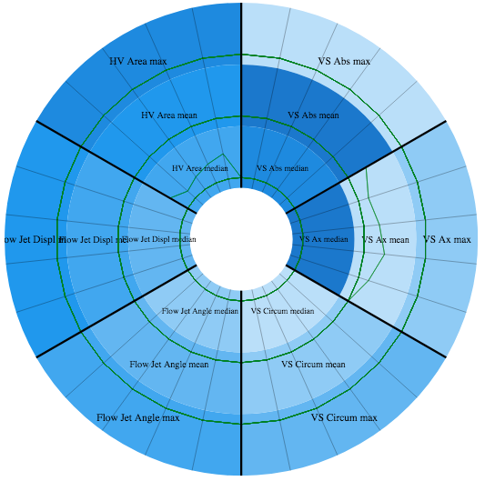

# D3BullseyeChart

Requirements:
1. Bullseye Chart (BC) constis of a dynamic number of donut subplots. <-- DONE!
2. BC is zoomable.
3. Each donut subplot fragment has a parallel coordinat subplot (example image shows still line charts).

Optional: Zooming from out to in has the effect that the last outer ring (level) disappears. 

My problem at the moment:
I want just 6 slices per level but I get all 18 from dataset.
Outer and Inner Radius is not easy to handle. Need nice radius calculation for each ring.

